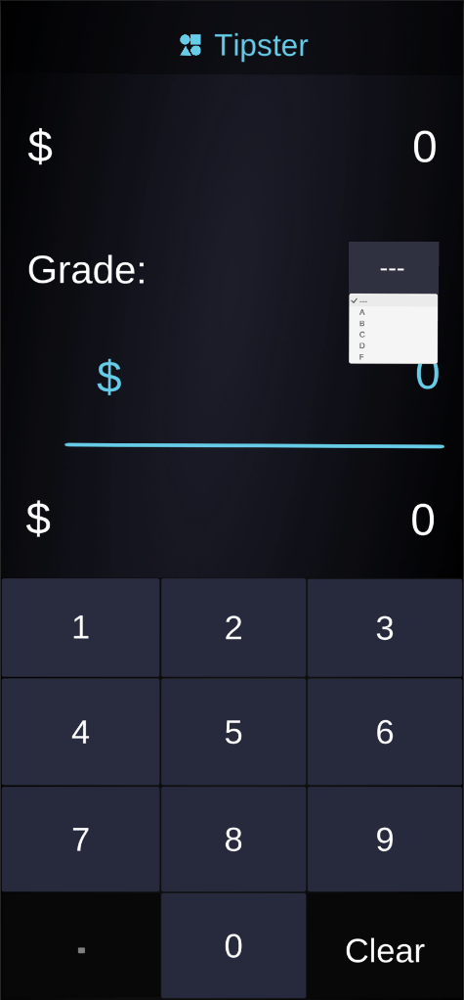

# Tipster
This is a simple tip calculator app created in Unity 2019.4.6f1. 
To calculate the tip, there is a dropdown menu to give a grade (A-D, F) which determines the 
tip percentage. The initial cost is typed in with buttons, and the Tip and Total lines are 
updated accordingly.
# Examples

  
  
  

